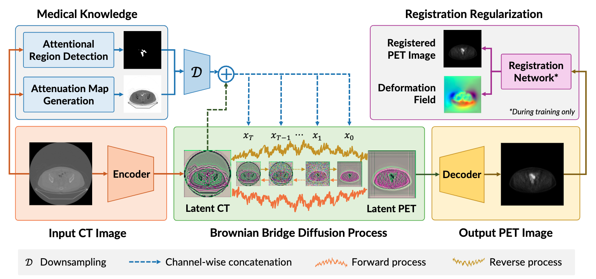

# RegCPDM: CT to PET Translation with Medical-Knowledge-Guided Diffusion Model

Authors: Dac Thai Nguyen, Huu Tien Nguyen, Trung Thanh Nguyen, Huy Hieu Pham, Thanh Hung Nguyen, Thao Nguyen Truong, Phi Le Nguyen, and Thanh Trung Nguyen. (*Dac Thai Nguyen and Huu Tien Nguyen contributed equally to this study.*)

***


## CT/PET Dataset
Please refer to this repo for information about the dataset: https://github.com/thanhhff/CPDM/

## Requirements
```commandline
cond env create -f environment.yml
conda activate RegCPDM
```

## Data preparation
The path of paired image dataset should be formatted as:
```yaml
your_dataset_path/train/A  # training reference
your_dataset_path/train/B  # training ground truth
your_dataset_path/val/A  # validating reference
your_dataset_path/val/B  # validating ground truth
your_dataset_path/test/A  # testing reference
your_dataset_path/test/B  # testing ground truth
```

## Train and test Segmentation Model for Object Detection in CT image
### Train your Segmentation Model
Specity your checkpoint path to save model and dataset path in <font color=violet><b>train_segmentation_model.py</b></font>. Run below command to train model.
```commandline
python train_segmentation_model.py
```
### Test your Segmentation Model
Specity your checkpoint path, dataset path and sampling path in <font color=violet><b>test_segmentation_model.py</b></font>. Run below command for sampling and saving results to your path.
```commandline
python test_segmentation_model.py
```
Note that you can modify this code for training, validation or testing sampling.

## Train and test RegCPDM
### Specify your configuration file
Modify the configuration file based on our templates in <font color=violet><b>configs/RegCPDM.yaml</b></font>. Don't forget to specify your VQGAN checkpoint path, dataset path and corresponding training and validation/testing sampling path of your Segmentation Model.

To train the model with Registration regularization, specify 'lambda1' and 'lambda2' in 'reg'. Otherwise, set 'reg' to None or remove it from the configuration entirely.

Note that you need to train your VQGAN (https://github.com/CompVis/taming-transformers) and sample results of Segmentation Model before starting training CPDM.
### Run
Specity your shell file based on our templates in <font color=violet><b>configs/Template-shell.sh</b></font>. Run below command to train or test model.
```commandline
sh shell/your_shell.sh
```

## Acknowledgement
```
This work was supported by Vingroup Joint Stock Company (Vingroup JSC), Vingroup; in part by the Vingroup Innovation Foundation (VINIF) under Project VINIF.2021.DA00128.
Our code is implemented based on Brownian Bridge Diffusion Model (https://github.com/xuekt98/BBDM)
```

## Citation
If you find this code useful for your research, please cite the following paper:
```
@inproceedings{nguyen2025RegCPDM,
  title = {CT to PET Translation with Medical-Knowledge-Guided Diffusion Model},
  author = {Nguyen, Dac Thai and Nguyen, Huu Tien and Nguyen, Trung Thanh and Pham, Huy Hieu and Nguyen, Thanh Hung and Truong, Thao Nguyen and Nguyen, Phi Le and Nguyen, Thanh Trung},
  year = {2025},
}
```

```
@inproceedings{nguyen2025CPDM,
  title = {CT to PET Translation: A Large-scale Dataset and Domain-Knowledge-Guided Diffusion Approach},
  author = {Nguyen, Dac Thai and Nguyen, Trung Thanh and Nguyen, Huu Tien and Nguyen, Thanh Trung and Pham, Huy Hieu and Nguyen, Thanh Hung and Truong, Thao Nguyen and Nguyen, Phi Le},
  booktitle = {Proceedings of the IEEE/CVF Winter Conference on Applications of Computer Vision},
  year = {2025},
}
```
